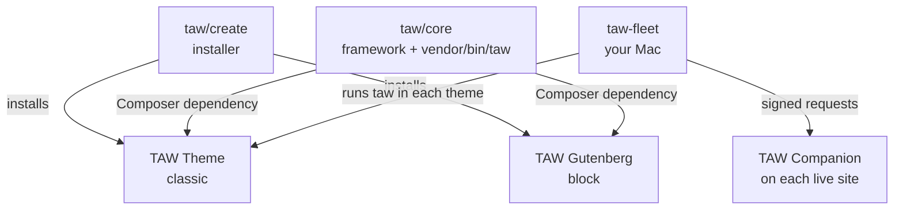

TAW is a few pieces that work together. At the center are two tools: **the `taw` command**, which runs inside one theme, and **taw-fleet**, which looks after every TAW site on your Mac and their production copies. The rest is the framework those tools work on.

## The pieces

| Piece | What it is | Where it runs | Get it |
|---|---|---|---|
| **[taw/core](/taw-core)** | The framework, as a Composer package: the data layer, the block-editor features, the classic-theme toolkit, and the `taw` command | Inside each theme, in `vendor/` | `composer update taw/core` |
| **[The `taw` command](/taw-command)** | `vendor/bin/taw`: scaffold blocks, read and write fields, move content, sync the framework, update the site | In a theme folder, on your Mac or in CI | Ships with taw/core 1.90+ |
| **[TAW Theme](/taw-theme)** | The classic starter theme: PHP blocks, metaboxes, Vite, Tailwind, Alpine | WordPress, one copy per site | `taw/create` |
| **[TAW Gutenberg](/taw-gutenberg)** | The block theme (full site editing). Its data comes from taw/core | WordPress, one copy per site | `taw/create` |
| **taw/create** | The installer: asks which theme to start from and installs it | Once, when a site starts | `composer create-project taw/create` |
| **[taw-fleet](/taw-fleet)** | A terminal app that finds every TAW site on your Mac and shows its status, versions, git, pull requests, deploys, production and client feedback | Your Mac (macOS, with Local) | `brew install Relmaur/tap/taw-fleet` |
| **[TAW Companion](/taw-hub-companion)** | A small plugin that answers taw-fleet's signed requests on a live site: health, plugins, vulnerabilities, logs, published content | Each production site, as an mu-plugin | A theme's `composer.json` |

## Where each tool fits in a day

- **Starting a site:** `taw-fleet create` (or `n` in the dashboard) makes a Local site and installs a TAW theme with `taw/create`. Without taw-fleet, run `composer create-project taw/create` yourself. See the [Quickstart](/quickstart).
- **Building it:** in the theme folder, `vendor/bin/taw make:block` scaffolds blocks, `fields:get` and `fields:set` read and write content, and `schema:validate` checks the data layer.
- **Keeping it current:** `vendor/bin/taw update`, or `u` in taw-fleet, updates taw/core and the framework's files in one step and opens a pull request. See [Updating a site](/updating).
- **Running many sites:** taw-fleet shows which sites are behind, dirty, failing CI or waiting on a deploy. It updates one site or all of them through `vendor/bin/taw update`, merges pull requests, pulls production content into Local, and starts Claude Code on a site's skills.
- **Moving content:** `vendor/bin/taw content:export` and `content:import` move content as one JSON file. taw-fleet's `pull` brings a live site's published content to Local through the companion.

## How a release reaches a site

taw/core and both themes have their own version numbers. A change travels in this order:

<Steps>
  <Step title="taw/core is tagged" icon="tag">
    A new version, such as `v1.91.0`. Nothing downstream changes yet: themes install taw/core by tag, not from its main branch.
  </Step>
  <Step title="The themes lock it" icon="lock">
    TAW Theme and TAW Gutenberg update their `composer.lock` to the new taw/core, then get their own release. A brand-new site starts from that lock.
  </Step>
  <Step title="Each site updates" icon="refresh-cw">
    A site's theme runs `vendor/bin/taw update`, or `composer update taw/core`, and merges the pull request. If the site's repository has a deploy workflow, merging deploys production. The scaffolds don't ship one: each site sets up its own.
  </Step>
</Steps>

## Versions

As of October 9, 2026:

| Piece | Version |
|---|---|
| taw/core | 1.92.0 |
| TAW Theme | 1.12.60 |
| TAW Gutenberg | 0.3.62 |
| taw-fleet | 1.15.0 |
| TAW Companion | 0.4.0 |
| taw/create | 0.1.0 |

The [Changelog](/changelog) has every release.
