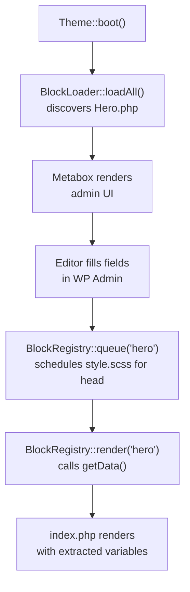

This guide builds a site on **TAW Theme**, the classic theme: PHP blocks with metabox fields, Vite, Tailwind and Alpine. For a block (full site editing) site, install **TAW Gutenberg** the same way and continue with [TAW Gutenberg](/taw-gutenberg).

## Before you start

<Callout kind="alert" collapsed="false">
  - **WordPress** 6.0+
  - **PHP** 8.2+
  - **Composer** 2.0+
  - **Node.js** 20.19+ and npm (TAW Gutenberg needs Node 22.12+)
  - **Git**, and a GitHub account for the theme's repository
</Callout>

---

## Step 1 — Create the site

<Tabs>
  <Tab title="With taw-fleet" icon="layout-dashboard">
    [taw-fleet](/taw-fleet) creates the Local site and the theme together. You need macOS with [Local](https://localwp.com) open.

    ```bash
    brew install Relmaur/tap/taw-fleet
    taw-fleet create "Acme Shop" --classic
    ```

    It asks for the WordPress admin's username and email, creates and starts the Local site, installs TAW Theme into `wp-content/themes/acme-shop`, builds the front-end assets, activates the theme, and makes the theme folder a git repository with a first commit. The admin password is shown once at the end. Press `n` in the dashboard for the same thing as a form.
  </Tab>

  <Tab title="With Composer" icon="terminal">
    Run the installer from your WordPress `wp-content/themes` folder:

    ```bash
    cd wp-content/themes

    TAW_STARTER=theme composer create-project taw/create my-theme \
      --repository='{"type":"vcs","url":"https://github.com/Relmaur/taw-create"}'
    ```

    It installs TAW Theme with taw/core and runs `npm install`. Without `TAW_STARTER`, it asks which theme you want. Then activate the theme in **WordPress Admin → Appearance → Themes**, and make the folder a repository:

    ```bash
    cd my-theme
    git init && git add -A && git commit -m "Initial commit"
    ```
  </Tab>
</Tabs>

Then push the theme to a new GitHub repository of its own, for example with `gh repo create acme-shop --private --source=. --push`. The theme shares no git history with the TAW Theme repository, and doesn't need to: framework updates arrive through taw/core, not through a merge.

Check that the `taw` command works:

```bash
vendor/bin/taw list
```

<Callout kind="success" collapsed="false">
  You see the TAW CLI with its commands, such as `make:block`, `update` and `content:export`. See [The taw command](/taw-command).
</Callout>

Start Vite while you work. It serves CSS and JS with hot reload on port 5173:

```bash
npm run dev
```

---

## Step 2 — Create your first block

TAW has two block types. For this quickstart we'll build a **MetaBlock** — a page section backed by metabox fields in the WordPress admin.

<Steps>
  <Step title="Scaffold the block with the CLI" icon="terminal" title-type="p">
    Run the block generator from your theme root:

    ```bash
    vendor/bin/taw make:block Hero --type=meta --with-style
    composer dump-autoload
    ```

    This creates `Blocks/Hero/` with three files:

    ```
    Blocks/Hero/
    ├── Hero.php       ← the block class
    ├── index.php      ← the template
    └── style.scss     ← per-block styles (auto-enqueued)
    ```

    <Callout kind="info" collapsed="false">
      `composer dump-autoload` is required after adding any new block class so Composer's PSR-4 classmap picks it up.
    </Callout>
  </Step>

  <Step title="Define your metabox fields" icon="edit" title-type="p">
    Open `Blocks/Hero/Hero.php`. The CLI generates a skeleton — fill in your fields inside `registerMetaboxes()` and return the data you need in `getData()`.

    ```php
    <?php
    // Blocks/Hero/Hero.php

    namespace TAW\Blocks\Hero;

    use TAW\Core\Block\MetaBlock;
    use TAW\Core\Metabox\Metabox;

    class Hero extends MetaBlock
    {
        protected string $id = 'hero';

        protected function registerMetaboxes(): void
        {
            new Metabox([
                'id'      => 'taw_hero',
                'title'   => 'Hero Section',
                'screens' => ['page'],
                'fields'  => [
                    ['id' => 'hero_heading', 'label' => 'Heading', 'type' => 'text',     'required' => true],
                    ['id' => 'hero_subtext', 'label' => 'Subtext', 'type' => 'textarea'],
                    ['id' => 'hero_image',   'label' => 'Image',   'type' => 'image'],
                ],
            ]);
        }

        protected function getData(int|false $postId): array
        {
            return [
                'heading'   => $this->getMeta($postId, 'hero_heading'),
                'subtext'   => $this->getMeta($postId, 'hero_subtext'),
                'image_url' => $this->getImageUrl($postId, 'hero_image', 'large'),
            ];
        }
    }
    ```

    TAW discovers the metabox automatically — it appears in the WordPress page editor as soon as the class is loaded.
  </Step>

  <Step title="Write the template" icon="code" title-type="p">
    Open `Blocks/Hero/index.php`. The variables returned by `getData()` are extracted into the template scope automatically.

    ```php
    <?php
    // Blocks/Hero/index.php

    if (empty($heading)) return;
    ?>

    <section class="hero">
        <h1><?php echo esc_html($heading); ?></h1>

        <?php if ($subtext): ?>
            <p><?php echo esc_html($subtext); ?></p>
        <?php endif; ?>

        <?php if ($image_url): ?>
            " alt="">
        <?php endif; ?>
    </section>
    ```
  </Step>
</Steps>

---

## Step 3 — Render the block on a page

In TAW Theme, blocks aren't Gutenberg blocks: you queue and render them from your PHP templates.

<Steps>
  <Step title="Queue and render in a WordPress template" icon="play" title-type="p">
    Open (or create) `front-page.php` in your theme root. Queue the block's assets before `get_header()`, then render it where it should appear in the page.

    ```php
    <?php
    // front-page.php

    use TAW\Core\Block\BlockRegistry;

    BlockRegistry::queue('hero');  // schedules CSS/JS for <head>
    get_header();
    ?>

    <?php BlockRegistry::render('hero'); ?>

    <?php get_footer(); ?>
    ```

    TAW automatically passes the current post ID to `getData()` and extracts the result into the template.
  </Step>

  <Step title="Fill in content in the WordPress admin" icon="edit" title-type="p">
    - Open a page in the WordPress editor.
    - Scroll down — your **Hero Section** metabox appears below the editor.
    - Fill in the Heading, Subtext, and Image fields.
    - Publish and visit the page.

    You should see your Hero block rendered with the content you entered.
  </Step>
</Steps>

---

## What you just built



- `BlockLoader::loadAll()` (called by `Theme::boot()`) discovered `Blocks/Hero/Hero.php` automatically — no registration required.
- `Metabox` rendered the admin UI and saved field values to `post_meta`.
- `BlockRegistry::queue('hero')` scheduled `style.scss` for `<head>` — only on pages that use this block.
- `BlockRegistry::render('hero')` called `getData()`, extracted the result, and loaded `index.php`.

---

## Add a second block type: UI Block

UI Blocks are stateless components that receive props at render time — no metaboxes, no post_meta.

```bash
vendor/bin/taw make:block Button --type=ui --with-style
composer dump-autoload
```

```php
// Blocks/Button/Button.php
namespace TAW\Blocks\Button;

use TAW\Core\Block\Block;

class Button extends Block
{
    protected string $id = 'button';

    protected function defaults(): array
    {
        return [
            'text'  => '',
            'url'   => '#',
            'style' => 'primary',
        ];
    }
}
```

Use it inside any template or MetaBlock template:

```php
<?php (new \TAW\Blocks\Button\Button())->render([
    'text' => 'Get Started',
    'url'  => '/contact',
]); ?>
```

Props are merged over the `defaults()` array — missing props always have safe fallbacks.

---

## Multi-block pages

Queue multiple blocks at once, then render each where it belongs:

```php
<?php
// front-page.php
use TAW\Core\Block\BlockRegistry;

BlockRegistry::queue('hero', 'features', 'stats', 'testimonials', 'cta');
get_header();
?>

<?php BlockRegistry::render('hero'); ?>
<?php BlockRegistry::render('features'); ?>
<?php BlockRegistry::render('stats'); ?>
<?php BlockRegistry::render('testimonials'); ?>
<?php BlockRegistry::render('cta'); ?>

<?php get_footer(); ?>
```

---

## Production build

When you're ready to deploy:

```bash
npm run build
```

Vite outputs content-hashed CSS and JS to `public/build/`. WordPress loads these automatically when the dev server is not running.

---

## Keep the site current

When taw/core releases a new version, update the theme in one step:

```bash
vendor/bin/taw update
```

It works on a new branch, updates taw/core and the framework's files, runs the migrations and the checks, and opens a pull request. The theme's `taw.json` decides what it may change. See [Updating a site](/updating).

---

## Next steps

<Columns cols="2">
  <Card title="The taw command" href="/taw-command" icon="terminal" horizontal="false">
    Every command a theme gets, and how to add your own.
  </Card>

  <Card title="taw-fleet" href="/taw-fleet" icon="layout-dashboard" horizontal="false">
    One dashboard for every TAW site on your Mac and its production copy.
  </Card>

  <Card title="Core concepts" href="/concepts" icon="book-open" horizontal="false">
    How blocks, MetaBlocks, assets and the boot process fit together.
  </Card>

  <Card title="Metabox and editor tooling" href="/taw-core-metabox" icon="edit" horizontal="false">
    Every field type and option for your blocks' metaboxes.
  </Card>
</Columns>
