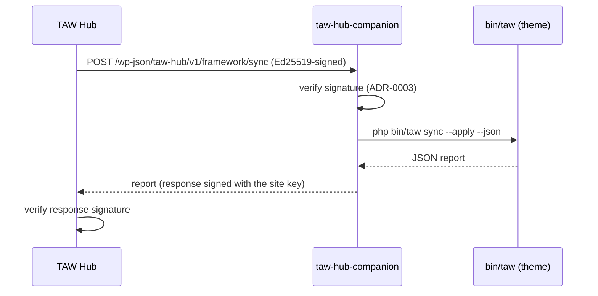

`taw-hub-companion` is a lightweight WordPress plugin that exposes a small, **signature-authenticated** REST surface on a TAW site so a central [TAW Hub](https://github.com/Relmaur/taw-hub) hub can check its health, run framework syncs, execute allow-listed `bin/taw` commands, and rotate its key — with no passwords.

<Callout kind="info">
  This replaces the short-lived `TAW\Hub` subsystem that shipped in `taw/core` v1.20.0 and was removed in v1.20.1. `taw/core` is a theme framework; fleet management is a separate concern with its own repo (`Relmaur/taw-hub-companion`), release cadence, and wire protocol.
</Callout>

## How it fits together



The plugin never contains fleet logic — it verifies the Hub, runs one bounded operation, signs the response, and returns.

## Install

<Callout kind="tip">
  On a TAW site, the fastest path is the **`hub-connect`** skill — it runs every step below interactively (installing the plugin, gathering the Hub's key, writing `wp-config.php` with confirmation, verifying, and surfacing the site key to register). Or run the primitive it wraps: `php bin/taw hub:install --activate` (requires `taw/core` ≥ v1.20.2), then do steps 2 and 4 by hand.
</Callout>

<Steps>
  <Step title="Add the plugin" icon="download">
    `php bin/taw hub:install` clones it into `wp-content/plugins/` (or add it manually and run `composer install` inside it). The plugin is **not** bundled with the theme — only fleet sites need it.
  </Step>
  <Step title="Configure wp-config.php" icon="settings">
    Configuration is read from constants only — never the options table.

    ```php
    define('TAW_HUB_PUBLIC_KEY', '…base64 Ed25519 public key from the Hub…'); // required
    define('TAW_HUB_KEY_ID',     'hub-local');                               // the Hub's key id (default: hub-local)
    // define('TAW_HUB_ALLOWED_IPS', '203.0.113.4, 203.0.113.5');            // optional source-IP allow-list
    // define('TAW_HUB_SITE_KEY_ID', 'site-abc123');                         // optional — override the site's own key id
    ```

    <Callout kind="alert">
      With no `TAW_HUB_PUBLIC_KEY` the plugin is **inert**: every route returns `501` and an admin notice tells you what to define.
    </Callout>
  </Step>
  <Step title="Activate" icon="power">
    On activation the plugin generates this site's own Ed25519 keypair (secret key stored autoload-off; never leaves the site).
  </Step>
  <Step title="Register the site with the Hub" icon="link">
    A signed `GET /wp-json/taw-hub/v1/health` returns `site_public_key` and `site_key_id` (also shown in an admin notice). Give those to the Hub operator so the Hub can verify this site's signed responses.
  </Step>
</Steps>

## Routes

All routes are under the `taw-hub/v1` namespace and require a valid Hub signature.

| Method | Route | Body / query | Returns |
|---|---|---|---|
| `GET` | `/health` | — | `ok`, PHP / WP / `taw/core` / plugin versions, `site_public_key`, `site_key_id`, `exec_available` |
| `GET` | `/inventory` | — | a security-focused SBOM — every plugin, must-use plugin, drop-in and theme (see below) |
| `GET` | `/inventory/checksums` | `?slug&type` | per-component SHA-256 file manifest — integrity + version-diff (see below) |
| `GET` | `/vulnerabilities` | — | the site scanner's findings (Defender Pro / Wordfence), normalized (see below) |
| `GET` | `/logs` | `?limit&level&code&since` | `{ count, entries: [...] }` — the structured log `taw/core` writes (see below) |
| `POST` | `/framework/sync` | `{ "dry_run": bool }` | the `php bin/taw sync --json` report verbatim |
| `POST` | `/taw` | `{ "command": string, "args": string[] }` | `{ exit_code, stdout, stderr }` |
| `POST` | `/keys/rotate` | — | `{ "public_key": "<base64>" }` — new keypair, same key id |

<Callout kind="tip">
  `/inventory` is a read-only, subprocess-free software bill of materials the Hub polls to correlate the fleet against vulnerability feeds, spot abandoned components, and flag pending updates — without SSH. Each plugin carries `version`, `active`, `auto_update`, `requires_wp` / `requires_php`, `tested_up_to` (from `readme.txt`), `update_version` (the pending version, or `null`), `update_source` (`wordpress_org` \| `external` \| `disabled` \| `unknown` — *who, if anyone, is watching it for updates*; `unknown` is the abandoned-plugin tell) and `main_file_mtime`. Themes carry the same signals where they apply; `dropins` is the bare list of present drop-in filenames (an unexpected `object-cache.php` / `db.php` is a classic persistence trick). Works on every host. The response shape is the Hub's [ADR-0013](https://github.com/Relmaur/taw-hub/blob/main/docs/ADR/0013-fleet-inventory-and-vulnerability-correlation.md) contract, pinned by `schema_version`; the companion mirrors the Hub's `inventory-snapshot.schema.json` into its test fixtures so the two can't drift.
</Callout>

<Callout kind="tip">
  `/inventory/checksums` is a per-component SHA-256 **file manifest** — ground truth for the Hub to spot a webshell dropped into a plugin folder, to diff one version of a component against the next when it updates (the "quiet backdoor on update" signal — a new phone-home, a new application password, a new drop-in), and to dedupe fleet-wide analysis by `(slug, version, tree_hash)`. **Summary mode** (no `slug`) returns just `tree_hash` + `file_count` per active component — a cheap "did anything change" poll; **detail mode** (`?slug=`) adds the full `relpath → sha256` map, and `?type=plugin|mu_plugin|theme` narrows the set. Only executable / script file types are hashed; `node_modules` and `.git` are skipped; symlinks are not followed. The companion only produces the manifest — all comparison is the Hub's.
</Callout>

<Callout kind="tip">
  `/vulnerabilities` reports the security findings the site's **own scanner** has already computed — the companion does no vulnerability matching itself. A per-scanner read adapter reads the scanner's stored results and normalizes them; `ScannerRegistry` picks the first installed scanner (fleet standard first, fallback after). Ships a **Defender / Defender Pro** adapter (reads the `defender_scan_item` table — known vulnerabilities with CVSS, plugins closed on wp.org, abandoned plugins; verified against Defender 6.2.4) and a **Wordfence** adapter (reads the `wfIssues` table — known vulnerabilities, abandoned plugins, directory removals; verified against Wordfence 8.2.x). Defender is checked first as the fleet standard. The `scanner` block carries `name`, `version`, and `last_scan_at` (`null` = installed but never scanned), so the Hub knows the source and how fresh it is. Each finding: `component_type`, `slug`, `installed_version`, `severity` (`critical|high|medium|low|unknown`), `cvss_score`, `kind` (`vulnerability|abandoned|removed|outdated`), `link`, `detected_at`. Read-only and DB-read-only, behind the same signature guard.
</Callout>

<Callout kind="tip">
  `/logs` serves the JSON-Lines file `taw/core`'s `TAW\Core\Log\Logger` writes to `wp-content/taw-logs/` — so the Hub can report on a site's swallowed exceptions, failed syncs, and misconfigurations without SSH. `limit` is capped at 500 (default 100); `level` is one of `debug|info|notice|warning|error|critical`; `code` is a prefix match (`form`, `mail.emailit`); `since` is an ISO-8601 timestamp. Read-only, and behind the same signature as every other route. If `taw/core` is old or has never logged, `entries` is just `[]`.
</Callout>

<Callout kind="tip">
  `/framework/sync` drives the **existing** `bin/taw sync` — the same operation `framework-sync.yml` runs — it does not reimplement per-site sync. `/taw` runs only an allow-listed subset (`sync`, `inspect`, `seo:extract`, `seo:inject`, `icons:sync`, `export:static`) through `proc_open` with an argv array — no shell. Filter `taw_hub_companion_taw_allowlist` to adjust per site.
</Callout>

<Callout kind="alert">
  **On `proc_open`-disabled hosts** — most managed WordPress hosting (WPMU DEV, WP Engine, Kinsta, …) — `/framework/sync` and `/taw` return `503 {"error":"exec_unavailable"}`; they shell out to `bin/taw` and cannot run. `/health` reports `"exec_available": false` so the Hub knows this up front, and `/logs` keeps working — neither spawns a subprocess. Run framework sync via the theme's own `framework-sync.yml` GitHub Action on those hosts.
</Callout>

## The wire protocol

Every request and response is signed. The full spec is **frozen** and governed by the Hub repo — see [ADR-0003 — Wire protocol & request signatures](https://github.com/Relmaur/taw-hub/blob/main/docs/ADR/0003-wire-protocol-and-signatures.md) and [ADR-0005 — Companion plugin architecture](https://github.com/Relmaur/taw-hub/blob/main/docs/ADR/0005-companion-plugin-architecture.md).

**Canonical string** (`\n`-joined, no trailing newline):

```
TAW-HUB-v1
{METHOD}                     upper-case verb, or the literal RESPONSE
{PATH}                       /wp-json/taw-hub/v1/…  (reconstructed from the matched route)
{TIMESTAMP}                  unix seconds
{NONCE}
{lowercase hex sha256(body)}
```

**Headers:** `X-Taw-Hub-Algo` (`ed25519` or `hmac-sha256`), `X-Taw-Hub-Key-Id`, `X-Taw-Hub-Timestamp`, `X-Taw-Hub-Nonce`, `X-Taw-Hub-Signature` (base64 of the raw signature bytes).

**Verification order** (mandatory): parse headers → `|now − timestamp| ≤ 60s` → resolve key by `(algo, keyId)` → cryptographic verify → consume the nonce (last, 150s TTL). Any failure → `401 {"error":"unauthorized","reason":"<code>"}` with a stable code (`malformed_signature_headers`, `timestamp_out_of_window`, `unknown_key_id`, `invalid_signature`, `replayed_nonce`).

<Callout kind="info">
  Responses are signed too, with `{METHOD}` set to the literal `RESPONSE`. The plugin's `SignatureGate`, `CanonicalString`, and signers are verified byte-for-byte against a fixture generated from the Hub's own signer (`hub-signing-vectors.json`) so the two implementations can't silently drift.
</Callout>

## Known limits

- The signed `{PATH}` is rebuilt from the matched REST route, so subdirectory WordPress installs work — but a **filtered `rest_get_url_prefix()`** (≠ `wp-json`) is unsupported and raises an admin notice.
- `/assets/sync` is not implemented — the Hub's Vite-bundle sync job is still deferred.
- Registration is manual (activate → copy key id + public key → register with the Hub) until an enrolment endpoint exists.
