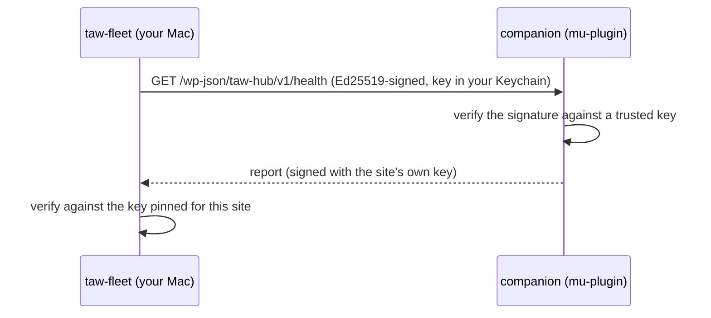

The **companion** (`taw/hub-companion`, repo [`Relmaur/taw-hub-companion`](https://github.com/Relmaur/taw-hub-companion)) is a small WordPress plugin that exposes a **signature-authenticated** REST surface on a live TAW site. [taw-fleet](/taw-fleet) uses it to show each production site's health, plugins, known vulnerabilities and recent logs, and to pull its published content into Local, with no passwords and no SSH. See [Production, pull requests and deploys](/taw-fleet-production).

<Callout kind="info">
  The companion was built for the TAW Hub control app, which was **retired on 2026-10-08**: taw-fleet now reads the sites directly. The wire protocol, the `taw-hub/v1` route names and the `TAW_HUB_*` constants keep their names.
</Callout>

## How it fits together


```mermaid
sequenceDiagram
    participant Fleet as taw-fleet (your Mac)
    participant Site as companion (mu-plugin)
    Fleet->>Site: GET /wp-json/taw-hub/v1/health  (Ed25519-signed, key in your Keychain)
    Site->>Site: verify the signature against a trusted key
    Site-->>Fleet: report  (signed with the site's own key)
    Fleet->>Fleet: verify against the key pinned for this site
```

The companion holds no fleet logic: it verifies the request, runs one bounded operation, signs the response and returns.

## Install

The companion ships with the theme, per client project, and runs as an **mu-plugin**: it can't be deactivated by accident, and it updates with the theme's `composer.lock`.

<Steps>
  <Step title="Require it in the theme" icon="package">
    In the theme's `composer.json`, add the repository, the requirement and the key the site trusts (taw-fleet's public key, from `taw-fleet live key show`):

    ```json
    {
      "repositories": [{ "type": "vcs", "url": "https://github.com/Relmaur/taw-hub-companion" }],
      "require": { "taw/hub-companion": "^0.4" },
      "extra": { "taw-companion": { "keys": { "taw-fleet": "…base64 public key…" } } }
    }
    ```

    Then run `composer update taw/hub-companion`. The key is public, so committing it is fine. It's per fleet owner, which is why the public taw-theme scaffold doesn't include it.

    `taw-fleet live` works with 0.3, the first version that runs as an mu-plugin. The `/content` route, and so `taw-fleet pull`, needs 0.4 or later.
  </Step>
  <Step title="Load it as an mu-plugin" icon="plug">
    Copy `vendor/taw/hub-companion/mu-loader/taw-companion.php` to `wp-content/mu-plugins/`. On TAW client sites, the theme's deploy workflow does this after the rsync. The loader finds the companion in the active theme's `vendor/` and never needs updating.

    <Callout kind="alert">
      The loader stands aside while the companion is still active as a **regular plugin** (two copies would mix their classes). Deactivate and delete the regular plugin, and the mu copy takes over on the next request.
    </Callout>
  </Step>
  <Step title="Check it from taw-fleet" icon="check">
    Pin the key the site signs with once: `taw-fleet live trust <site>`. Then `taw-fleet live <site>` shows the site's versions and findings, and every answer is verified.
  </Step>
</Steps>

On first use the companion creates the site's own Ed25519 keypair (stored autoload-off; the secret never leaves the site). A site that already had the companion as a regular plugin keeps its keypair.

`TAW_HUB_PUBLIC_KEY` (with `TAW_HUB_KEY_ID`) in `wp-config.php` still works next to theme keys. With no trusted key at all, the companion is **inert**: every route returns `501`.

## Updating

As an mu-plugin, the companion updates with the theme: `composer update taw/hub-companion`, then deploy. Installed as a regular plugin (the old way), it self-updates from its GitHub releases.

## Routes

All routes are under the `taw-hub/v1` namespace and require a valid signature from a trusted key. taw-fleet uses the `GET` routes only.

| Method | Route | Body / query | Returns |
|---|---|---|---|
| `GET` | `/health` | — | `ok`, PHP / WP / `taw/core` / companion versions, `site_public_key`, `site_key_id`, `exec_available` |
| `GET` | `/inventory` | — | a security-focused SBOM — every plugin, must-use plugin, drop-in and theme (see below) |
| `GET` | `/inventory/checksums` | `?slug&type` | per-component SHA-256 file manifest — integrity + version-diff (see below) |
| `GET` | `/vulnerabilities` | — | the site scanner's findings (Defender Pro / Wordfence), normalized (see below) |
| `GET` | `/logs` | `?limit&level&code&since` | `{ count, entries: [...] }` — the structured log `taw/core` writes (see below) |
| `GET` | `/content` | `?types` | the published content as a taw/core Content Interchange snapshot (no drafts, users, comments or settings), for `taw-fleet pull` (0.4.0+) |
| `POST` | `/framework/sync` | `{ "dry_run": bool }` | the `php bin/taw sync --json` report verbatim |
| `POST` | `/taw` | `{ "command": string, "args": string[] }` | `{ exit_code, stdout, stderr }` |
| `POST` | `/keys/rotate` | — | `{ "public_key": "<base64>" }` — new keypair, same key id |

<Callout kind="tip">
  `/inventory` is a read-only, subprocess-free software bill of materials taw-fleet reads to correlate the fleet against vulnerability feeds, spot abandoned components, and flag pending updates — without SSH. Each plugin carries `version`, `active`, `auto_update`, `requires_wp` / `requires_php`, `tested_up_to` (from `readme.txt`), `update_version` (the pending version, or `null`), `update_source` (`wordpress_org` \| `external` \| `disabled` \| `unknown` — *who, if anyone, is watching it for updates*; `unknown` is the abandoned-plugin tell) and `main_file_mtime`. Themes carry the same signals where they apply; `dropins` is the bare list of present drop-in filenames (an unexpected `object-cache.php` / `db.php` is a classic persistence trick). Works on every host. The response shape is pinned by `schema_version` and `docs/reference/inventory-snapshot.schema.json` in the companion repo.
</Callout>

<Callout kind="tip">
  `/inventory/checksums` is a per-component SHA-256 **file manifest** — ground truth for spotting a webshell dropped into a plugin folder, to diff one version of a component against the next when it updates (the "quiet backdoor on update" signal — a new phone-home, a new application password, a new drop-in), and to dedupe fleet-wide analysis by `(slug, version, tree_hash)`. **Summary mode** (no `slug`) returns just `tree_hash` + `file_count` per active component — a cheap "did anything change" poll; **detail mode** (`?slug=`) adds the full `relpath → sha256` map, and `?type=plugin|mu_plugin|theme` narrows the set. Only executable / script file types are hashed; `node_modules` and `.git` are skipped; symlinks are not followed. The companion only produces the manifest; the comparison is up to the client.
</Callout>

<Callout kind="tip">
  `/vulnerabilities` reports the security findings the site's **own scanner** has already computed — the companion does no vulnerability matching itself. A per-scanner read adapter reads the scanner's stored results and normalizes them; `ScannerRegistry` picks the first installed scanner (fleet standard first, fallback after). Ships a **Defender / Defender Pro** adapter (reads the `defender_scan_item` table — known vulnerabilities with CVSS, plugins closed on wp.org, abandoned plugins; verified against Defender 6.2.4) and a **Wordfence** adapter (reads the `wfIssues` table — known vulnerabilities, abandoned plugins, directory removals; verified against Wordfence 8.2.x). Defender is checked first as the fleet standard. The `scanner` block carries `name`, `version`, and `last_scan_at` (`null` = installed but never scanned), so the client knows the source and how fresh it is. Each finding: `component_type`, `slug`, `installed_version`, `severity` (`critical|high|medium|low|unknown`), `cvss_score`, `kind` (`vulnerability|abandoned|removed|outdated`), `link`, `detected_at`. Read-only and DB-read-only, behind the same signature guard.
</Callout>

<Callout kind="tip">
  `/logs` serves the JSON-Lines file `taw/core`'s `TAW\Core\Log\Logger` writes to `wp-content/taw-logs/` — so a client can report on a site's swallowed exceptions, failed syncs, and misconfigurations without SSH. `limit` is capped at 500 (default 100); `level` is one of `debug|info|notice|warning|error|critical`; `code` is a prefix match (`form`, `mail.emailit`); `since` is an ISO-8601 timestamp. Read-only, and behind the same signature as every other route. If `taw/core` is old or has never logged, `entries` is just `[]`.
</Callout>

<Callout kind="tip">
  `/framework/sync` drives the **existing** `bin/taw sync` — the same operation `framework-sync.yml` runs — it does not reimplement per-site sync. `/taw` runs only an allow-listed subset (`sync`, `inspect`, `seo:extract`, `seo:inject`, `icons:sync`, `export:static`) through `proc_open` with an argv array — no shell. Filter `taw_hub_companion_taw_allowlist` to adjust per site.
</Callout>

<Callout kind="alert">
  **On `proc_open`-disabled hosts** — most managed WordPress hosting (WPMU DEV, WP Engine, Kinsta, …) — `/framework/sync` and `/taw` return `503 {"error":"exec_unavailable"}`; they shell out to `bin/taw` and cannot run. `/health` reports `"exec_available": false` up front, and `/logs` keeps working — neither spawns a subprocess. Run framework sync via the theme's own `framework-sync.yml` GitHub Action on those hosts.
</Callout>

## The wire protocol

Every request and response is signed. The spec is **frozen** and lives in the companion repo: [the wire protocol](https://github.com/Relmaur/taw-hub-companion/blob/main/docs/reference/wire-protocol.md), [ADR-0003](https://github.com/Relmaur/taw-hub-companion/blob/main/docs/adr/0003-wire-protocol-and-signatures.md) and [ADR-0005](https://github.com/Relmaur/taw-hub-companion/blob/main/docs/adr/0005-companion-plugin-architecture.md).

**Canonical string** (`\n`-joined, no trailing newline):

```
TAW-HUB-v1
{METHOD}                     upper-case verb, or the literal RESPONSE
{PATH}                       /wp-json/taw-hub/v1/…  (reconstructed from the matched route)
{TIMESTAMP}                  unix seconds
{NONCE}
{lowercase hex sha256(body)}
```

**Headers:** `X-Taw-Hub-Algo` (`ed25519` or `hmac-sha256`), `X-Taw-Hub-Key-Id`, `X-Taw-Hub-Timestamp`, `X-Taw-Hub-Nonce`, `X-Taw-Hub-Signature` (base64 of the raw signature bytes).

**Verification order** (mandatory): parse headers → `|now − timestamp| ≤ 60s` → resolve key by `(algo, keyId)` → cryptographic verify → consume the nonce (last, 150s TTL). Any failure → `401` with `{"code":"taw_hub_unauthorized","data":{"reason":"<code>"}}` and a stable reason (`malformed_signature_headers`, `timestamp_out_of_window`, `unknown_key_id`, `invalid_signature`, `replayed_nonce`).

<Callout kind="info">
  Responses are signed too, with `{METHOD}` set to the literal `RESPONSE`. The plugin's `SignatureGate`, `CanonicalString`, and signers are verified byte-for-byte against `hub-signing-vectors.json`, and taw-fleet's Go signer is tested against the same vectors, so the two implementations can't silently drift.
</Callout>

## Known limits

- The signed `{PATH}` is rebuilt from the matched REST route, so subdirectory WordPress installs work — but a **filtered `rest_get_url_prefix()`** (≠ `wp-json`) is unsupported and raises an admin notice.
- taw-fleet doesn't use the write routes (`/framework/sync`, `/taw`, `/keys/rotate`). Run framework sync through the theme's `framework-sync.yml` workflow.
- `php bin/taw hub:install` and `hub:enroll` are retired (taw/core v1.77.0).
