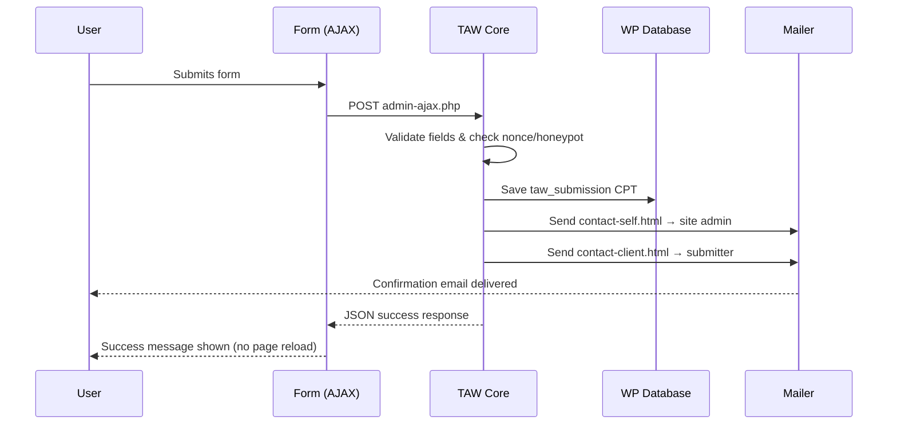

By the end of this tutorial you will have a `ContactBlock` that registers a contact form, sends a branded admin notification and a submitter confirmation — all driven by TAW's built-in `Form` and `Mailer` APIs, with no plugin dependencies.

---

## Prerequisites

- A working TAW Theme install with `taw/core` via Composer
- The MJML CLI installed globally for compiling templates before deploy: `npm install -g mjml`

<Callout kind="info" collapsed="false">
  In development, `spatie/mjml-php` (a `taw/core` dev dependency) compiles MJML files at runtime — no extra step needed. The MJML CLI is only required to produce the pre-compiled HTML files for production.
</Callout>

---

## Steps

<Steps>
  <Step title="Scaffold the block" icon="terminal" title-type="p">
    Generate a UI Block for the contact form. A UI Block (not MetaBlock) is the right choice here — the form doesn't need metabox fields; it manages its own data through the Forms API.

    ```bash
    php bin/taw make:block ContactBlock --type=ui --with-style
    composer dump-autoload
    ```

    This creates `Blocks/ContactBlock/` with:

    ```
    Blocks/ContactBlock/
    ├── ContactBlock.php
    ├── index.php
    └── style.scss
    ```
  </Step>

  <Step title="Register the form in boot()" icon="code" title-type="p">
    Forms **must** be registered on every request — not just when the template renders — because the AJAX handler needs to exist for `admin-ajax.php`. The correct place is the static `boot()` method, wrapped in `add_action('init', ...)`.

    Open `Blocks/ContactBlock/ContactBlock.php`:

    ```php
    <?php
    // Blocks/ContactBlock/ContactBlock.php

    namespace TAW\Blocks\ContactBlock;

    use TAW\Core\Block\Block;
    use TAW\Core\Form\Form;

    class ContactBlock extends Block
    {
        protected string $id = 'contact-block';

        public static function boot(): void
        {
            add_action('init', static function () {
                Form::register([
                    'id'           => 'contact',
                    'submit_label' => 'Send Message',
                    'messages'     => [
                        'success' => "Thanks! We'll be back to you shortly.",
                    ],
                    'email' => [
                        'to_self' => [
                            'subject'  => 'New contact form submission',
                            'template' => 'contact-self',   // → mails/html/contact-self.html
                        ],
                        'to_client' => [
                            'subject'  => "We got your message!",
                            'template' => 'contact-client', // → mails/html/contact-client.html
                        ],
                    ],
                    'fields' => [
                        ['id' => 'name',    'label' => 'Your Name',     'type' => 'text',     'required' => true,  'width' => 50],
                        ['id' => 'email',   'label' => 'Email Address',  'type' => 'email',    'required' => true,  'width' => 50],
                        ['id' => 'subject', 'label' => 'Subject',        'type' => 'text',     'required' => false],
                        ['id' => 'message', 'label' => 'Message',        'type' => 'textarea', 'required' => true],
                    ],
                ]);
            });
        }

        protected function defaultData(): array
        {
            return [];
        }
    }
    ```

    <Callout kind="tip" collapsed="false">
      The `to_client` email uses the submitted `email` field value as the recipient address automatically — no extra config needed. TAW also stores every successful submission under **WP Admin → Submissions**.
    </Callout>
  </Step>

  <Step title="Render the form in the template" icon="layout" title-type="p">
    Open `Blocks/ContactBlock/index.php` and call `Form::display()` with the form ID you registered in `boot()`.

    ```php
    <?php
    // Blocks/ContactBlock/index.php

    use TAW\Core\Form\Form;
    ?>

    <section class="contact-section">
        <div class="contact-section__inner">
            <h2 class="contact-section__title">Get in touch</h2>
            <p class="contact-section__lead">
                Fill in the form and we'll get back to you within 24 hours.
            </p>

            <?php Form::display('contact'); ?>
        </div>
    </section>
    ```
  </Step>

  <Step title="Create the MJML templates" icon="mail" title-type="p">
    MJML templates live in your theme's `mails/` folder. Create the directories first:

    ```bash
    mkdir -p mails mails/html
    ```

    #### Admin notification (`contact-self.mjml`)

    ```xml
    <!-- mails/contact-self.mjml -->
    <mjml>
      <mj-head>
        <mj-font name="Inter" href="https://fonts.googleapis.com/css2?family=Inter:wght@400;600&display=swap" />
        <mj-attributes>
          <mj-all font-family="Inter, sans-serif" />
          <mj-text font-size="15px" line-height="1.6" color="#1a1a1a" />
        </mj-attributes>
      </mj-head>

      <mj-body background-color="#f4f4f5">

        <mj-section background-color="#111827" padding="24px 32px">
          <mj-column>
            <mj-text color="#ffffff" font-size="20px" font-weight="600">
              New Contact Form Submission
            </mj-text>
          </mj-column>
        </mj-section>

        <mj-section background-color="#ffffff" padding="32px" border-radius="0 0 8px 8px">
          <mj-column>
            <mj-text>You have received a new message through the contact form:</mj-text>
            <mj-divider border-color="#e5e7eb" border-width="1px" padding="16px 0" />
            <mj-text><strong>Name:</strong> {{name}}</mj-text>
            <mj-text><strong>Email:</strong> {{email}}</mj-text>
            <mj-text><strong>Subject:</strong> {{subject}}</mj-text>
            <mj-divider border-color="#e5e7eb" border-width="1px" padding="16px 0" />
            <mj-text><strong>Message:</strong></mj-text>
            <mj-text color="#374151">{{message}}</mj-text>
            <mj-button background-color="#f97316" color="#ffffff" href="mailto:{{email}}">
              Reply to {{name}}
            </mj-button>
          </mj-column>
        </mj-section>

        <mj-section padding="16px">
          <mj-column>
            <mj-text font-size="12px" color="#9ca3af" align="center">
              Sent via the contact form on your website.
            </mj-text>
          </mj-column>
        </mj-section>

      </mj-body>
    </mjml>
    ```

    #### Submitter confirmation (`contact-client.mjml`)

    ```xml
    <!-- mails/contact-client.mjml -->
    <mjml>
      <mj-head>
        <mj-font name="Inter" href="https://fonts.googleapis.com/css2?family=Inter:wght@400;600&display=swap" />
        <mj-attributes>
          <mj-all font-family="Inter, sans-serif" />
          <mj-text font-size="15px" line-height="1.6" color="#1a1a1a" />
        </mj-attributes>
      </mj-head>

      <mj-body background-color="#f4f4f5">

        <mj-section background-color="#111827" padding="24px 32px">
          <mj-column>
            <mj-text color="#ffffff" font-size="20px" font-weight="600">
              We got your message, {{name}}!
            </mj-text>
          </mj-column>
        </mj-section>

        <mj-section background-color="#ffffff" padding="32px" border-radius="0 0 8px 8px">
          <mj-column>
            <mj-text>
              Thanks for reaching out. We've received your message and will reply
              to <strong>{{email}}</strong> within 24 hours.
            </mj-text>
            <mj-divider border-color="#e5e7eb" border-width="1px" padding="16px 0" />
            <mj-text color="#6b7280" font-size="13px">Here's a copy of what you sent:</mj-text>
            <mj-text color="#374151" font-style="italic">"{{message}}"</mj-text>
          </mj-column>
        </mj-section>

        <mj-section padding="16px">
          <mj-column>
            <mj-text font-size="12px" color="#9ca3af" align="center">
              You're receiving this because you submitted a contact form on our website.
            </mj-text>
          </mj-column>
        </mj-section>

      </mj-body>
    </mjml>
    ```

    <Callout kind="tip" collapsed="false">
      Use `{{variable_name}}` placeholders anywhere in your MJML. TAW replaces them with the submitted field values at send time — the placeholder names match your form `field id` values.
    </Callout>
  </Step>

  <Step title="Compile MJML to HTML for production" icon="package" title-type="p">
    In development, `spatie/mjml-php` compiles MJML at runtime automatically. Before deploying, pre-compile each template to `mails/html/`:

    ```bash
    mjml mails/contact-self.mjml   -o mails/html/contact-self.html
    mjml mails/contact-client.mjml -o mails/html/contact-client.html
    ```

    <Callout kind="danger" collapsed="false">
      Always commit the compiled `mails/html/*.html` files to your repository. In production, `Mailer` reads from `mails/html/` only — it does **not** compile MJML at runtime.
    </Callout>
  </Step>

  <Step title="Use the block on a page" icon="play" title-type="p">
    Queue and render the block in any WordPress page template:

    ```php
    <?php
    // contact.php

    use TAW\Core\Block\BlockRegistry;

    BlockRegistry::queue('contact-block');
    get_header();
    ?>

    <?php BlockRegistry::render('contact-block'); ?>

    <?php get_footer(); ?>
    ```
  </Step>

  <Step title="Test email delivery" icon="check-circle" title-type="p">
    Register `MailTester` in `functions.php` to get a **Tools → Test Emails** admin page. Use it to send test emails against your compiled templates without needing a real form submission.

    ```php
    // functions.php
    (new \TAW\Core\Mail\MailTester())->register();
    ```

    Go to **WP Admin → Tools → Test Emails**, select `contact-self` or `contact-client`, fill in the test variables (`name`, `email`, `subject`, `message`), and send. Verify layout and delivery before going live.

    <Callout kind="success" collapsed="false">
      If both emails arrive correctly, your setup is complete. TAW handles CSRF protection, honeypot filtering, field sanitization, submission storage, and email delivery automatically — your code is just the config and the templates.
    </Callout>
  </Step>
</Steps>

---

## How it all fits together



---

## What to build next

<Columns cols="2">
  <Card title="Multi-step forms" href="/taw-core" icon="layers" horizontal="false">
    Replace `fields` with `steps` to build multi-page wizard forms with per-step validation.
  </Card>

  <Card title="Conditional fields" href="/taw-core" icon="git-branch" horizontal="false">
    Show or hide fields based on other field values using AND or OR logic.
  </Card>

  <Card title="Webhook forwarding" href="/taw-core" icon="send" horizontal="false">
    Forward every submission to n8n, Zapier, or Make via the signed webhook config under Settings → Form Webhook.
  </Card>

  <Card title="Build your first MetaBlock" href="/tutorials/first-metablock" icon="package" horizontal="false">
    Learn how MetaBlocks work to build any page section backed by WordPress admin fields.
  </Card>
</Columns>
