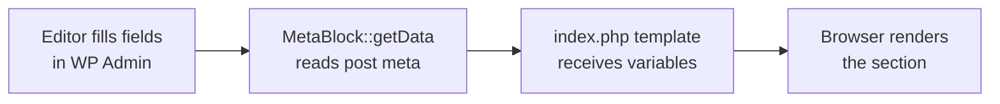

This tutorial walks you through building a **Hero** section — the most common first block on any site. By the end you'll understand the full MetaBlock lifecycle and be ready to build any block in TAW.

## What is a MetaBlock?

A MetaBlock is a page section that owns its own data. Editors fill in fields in the WordPress admin; the block reads those values and renders them. No Gutenberg, no ACF, no external plugin.



---

## Prerequisites

- A working TAW Theme install (`composer install` + `npm install` done)
- Vite dev server running (`npm run dev`)

---

## Steps

<Steps>
  <Step title="Scaffold the block" icon="terminal" title-type="p">
    Run the `make:block` CLI command from your theme root. The `--type=meta` flag generates a MetaBlock skeleton; `--with-style` adds a `style.scss` wired into the Vite pipeline.

    ```bash
    php bin/taw make:block Hero --type=meta --with-style
    composer dump-autoload
    ```

    This creates `Blocks/Hero/` with three files:

    ```
    Blocks/Hero/
    ├── Hero.php       ← the MetaBlock class
    ├── index.php      ← the template
    └── style.scss     ← per-block styles (only loaded on pages that use this block)
    ```

    <Callout kind="info" collapsed="false">
      `composer dump-autoload` is required after adding any new block class so Composer's PSR-4 classmap picks it up.
    </Callout>
  </Step>

  <Step title="Define the metabox fields" icon="edit" title-type="p">
    Open `Blocks/Hero/Hero.php`. Replace the scaffold stub with real fields in `registerMetaboxes()` and return what the template needs from `getData()`.

    ```php
    <?php
    // Blocks/Hero/Hero.php

    namespace TAW\Blocks\Hero;

    use TAW\Core\Block\MetaBlock;
    use TAW\Core\Metabox\Metabox;

    class Hero extends MetaBlock
    {
        protected string $id = 'hero';

        protected function registerMetaboxes(): void
        {
            new Metabox([
                'id'      => 'taw_hero',
                'title'   => 'Hero Section',
                'screens' => ['page'],
                'fields'  => [
                    ['id' => 'heading',  'label' => 'Heading',          'type' => 'text',    'required' => true, 'width' => '60'],
                    ['id' => 'tagline',  'label' => 'Tagline',          'type' => 'text',                        'width' => '40'],
                    ['id' => 'content',  'label' => 'Body text',        'type' => 'wysiwyg', 'rows' => 5],
                    ['id' => 'image',    'label' => 'Background image', 'type' => 'image'],
                    ['id' => 'bg_color', 'label' => 'Background color', 'type' => 'color',   'default' => '#111827'],
                    ['id' => 'cta_text', 'label' => 'CTA label',        'type' => 'text',    'width' => '50'],
                    ['id' => 'cta_url',  'label' => 'CTA URL',          'type' => 'url',     'width' => '50'],
                ],
                'tabs' => [
                    ['label' => 'Content', 'fields' => ['heading', 'tagline', 'content', 'cta_text', 'cta_url']],
                    ['label' => 'Design',  'fields' => ['image', 'bg_color']],
                ],
            ]);
        }

        protected function getData(int|false $postId): array
        {
            return [
                'heading'   => $this->getMeta($postId, 'heading'),
                'tagline'   => $this->getMeta($postId, 'tagline'),
                'content'   => $this->getMeta($postId, 'content'),
                'image_url' => $this->getImageUrl($postId, 'image', 'full'),
                'bg_color'  => \TAW\Core\Metabox\Metabox::get_color($postId, 'bg_color', '#111827'),
                'cta_text'  => $this->getMeta($postId, 'cta_text'),
                'cta_url'   => $this->getMeta($postId, 'cta_url'),
            ];
        }
    }
    ```

    `registerMetaboxes()` runs at WordPress's `init` action — translation functions are always safe here. `getData()` accepts `int|false` so blocks return safe empty values on 404 pages.
  </Step>

  <Step title="Write the template" icon="code" title-type="p">
    Open `Blocks/Hero/index.php`. Every key returned by `getData()` is available as a plain local variable via `extract()`.

    ```php
    <?php
    // Blocks/Hero/index.php

    if (empty($heading)) return;
    ?>

    <section
        class="hero"
        style="background-color: <?php echo esc_attr($bg_color); ?>;"
    >
        <?php if ($image_url): ?>
            <div
                class="hero__bg"
                style="background-image: url('<?php echo esc_url($image_url); ?>');"
                aria-hidden="true"
            ></div>
        <?php endif; ?>

        <div class="hero__inner">

            <?php if ($tagline): ?>
                <p class="hero__tagline"><?php echo esc_html($tagline); ?></p>
            <?php endif; ?>

            <h1 class="hero__heading"><?php echo esc_html($heading); ?></h1>

            <?php if ($content): ?>
                <div class="hero__content"><?php echo wp_kses_post($content); ?></div>
            <?php endif; ?>

            <?php if ($cta_text && $cta_url): ?>
                <a class="hero__cta" href="<?php echo esc_url($cta_url); ?>">
                    <?php echo esc_html($cta_text); ?>
                </a>
            <?php endif; ?>

        </div>
    </section>
    ```

    <Callout kind="tip" collapsed="false">
      Always guard against empty values with an early `return`. A page that hasn't had fields filled in yet should render nothing — not a broken section.
    </Callout>
  </Step>

  <Step title="Add per-block styles" icon="paintbrush" title-type="p">
    Open `Blocks/Hero/style.scss`. This file is compiled by Vite and enqueued as a `<link>` tag **only** on pages that render this block.

    ```scss
    // Blocks/Hero/style.scss

    .hero {
        position: relative;
        display: flex;
        align-items: center;
        min-height: 560px;
        overflow: hidden;
        padding: 80px 24px;

        &__bg {
            position: absolute;
            inset: 0;
            background-size: cover;
            background-position: center;
            opacity: 0.35;
        }

        &__inner {
            position: relative;
            max-width: 760px;
            margin: 0 auto;
            text-align: center;
            color: #fff;
        }

        &__tagline {
            font-size: 0.875rem;
            font-weight: 600;
            letter-spacing: 0.1em;
            text-transform: uppercase;
            opacity: 0.7;
            margin-bottom: 12px;
        }

        &__heading {
            font-size: clamp(2rem, 5vw, 3.5rem);
            font-weight: 700;
            line-height: 1.1;
            margin-bottom: 24px;
        }

        &__content {
            font-size: 1.125rem;
            opacity: 0.85;
            margin-bottom: 32px;
        }

        &__cta {
            display: inline-block;
            padding: 14px 32px;
            background: #f97316;
            color: #fff;
            border-radius: 6px;
            font-weight: 600;
            text-decoration: none;
            transition: opacity 150ms ease;

            &:hover { opacity: 0.85; }
        }
    }
    ```
  </Step>

  <Step title="Render the block on a page" icon="play" title-type="p">
    Queue assets before `get_header()`, then render the block in your WordPress template.

    ```php
    <?php
    // front-page.php

    use TAW\Core\Block\BlockRegistry;

    BlockRegistry::queue('hero');   // schedules CSS/JS for <head>
    get_header();
    ?>

    <?php BlockRegistry::render('hero'); ?>

    <?php get_footer(); ?>
    ```

    For a multi-section homepage, queue everything up front:

    ```php
    BlockRegistry::queue('hero', 'features', 'stats', 'testimonials', 'cta');
    ```
  </Step>

  <Step title="Fill in content in WP Admin" icon="monitor" title-type="p">
    - Go to **WP Admin → Pages** and open or create a page.
    - Scroll below the editor — the **Hero Section** metabox appears with **Content** and **Design** tabs.
    - Fill in the fields, publish, and visit the front end.

    <Callout kind="success" collapsed="false">
      You should see the Hero section rendered with the content you entered. The `style.scss` was only loaded on this page — no other page carries that CSS.
    </Callout>

    <Callout kind="info" collapsed="false">
      The metabox only appears on pages because we passed `'screens' => ['page']`. Add `'post'` to that array to show it on posts too, or pass a page template filename (e.g. `'front-page.php'`) to restrict it further.
    </Callout>
  </Step>
</Steps>

---

## What to build next

Now that you have the pattern, every new block follows the same three steps: scaffold → register fields and `getData()` → write `index.php`.

<Columns cols="2">
  <Card title="Repeater fields" href="/taw-core-metabox" icon="layers" horizontal="false">
    Build sortable lists of team members, features, or testimonials with the `repeater` field type.
  </Card>

  <Card title="UI Blocks" href="/taw-core-blocks" icon="package" horizontal="false">
    Build stateless components like buttons and cards, then nest them inside MetaBlock templates.
  </Card>

  <Card title="Block variations" href="/taw-core-blocks" icon="copy" horizontal="false">
    Register multiple layout variants from a single MetaBlock class.
  </Card>

  <Card title="View transitions" href="/taw-core-assets-vite" icon="zap" horizontal="false">
    Learn how block scripts interact with Swup page transitions and the Alpine.js lifecycle.
  </Card>
</Columns>
