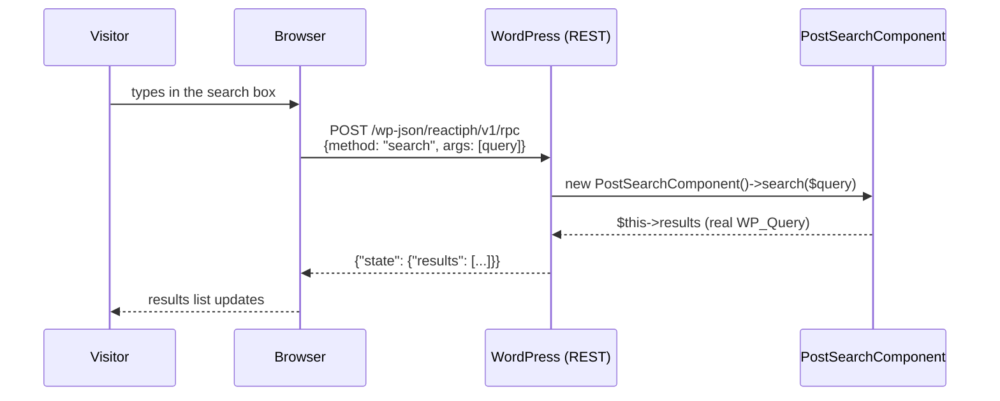

This tutorial builds a **post search** box: a visitor types, and matching posts appear below the input without a page reload — no jQuery, no hand-rolled AJAX boilerplate, no separate JS framework. It's powered by [Reactiph](https://github.com/Relmaur/reactiph), a reactive PHP component framework developed alongside TAW, integrated via the `reactiph/taw-bridge` package.

<Callout kind="info" collapsed="false">
  Reactiph is a separate, actively-evolving project — not part of `taw-core` — installed as its own Composer dependency. It has no tagged stable release yet (`dev-main` only), so treat this integration as early and expect its API to keep moving.
</Callout>

## Why not `ReactiveMetaBlock`?

`reactiph/taw-bridge` ships a `ReactiveMetaBlock` class that lets a Reactiph component's client-side interactivity run as real, transpiled JavaScript — no network request per click. That's the right tool for state that lives entirely in the browser (a counter, a toggle, a tab switcher).

Post search needs something `ReactiveMetaBlock` can't give it: a real `WP_Query` against your database. Reactiph's PHP→JS transpiler only understands a safe subset of PHP (arithmetic, string ops, array access, `$this->method()` calls) — and `ReactiveMetaBlock` always transpiles every method on the component it renders, with no way yet to mark one as server-only. A method that calls `get_posts()` will fail to transpile.

So this tutorial uses the pattern Reactiph's own docs call out for exactly this case: a component whose interactivity is a genuine **RPC round-trip** — a real HTTP request to a REST endpoint that runs the method on the server and returns the result — authored by hand instead of relying on `ReactiveMetaBlock`'s automatic transpilation. You still get a real Reactiph component (same base class, same template syntax); you're just wiring its one interactive method yourself instead of asking the transpiler to.



---

## Prerequisites

- A working TAW Theme install (`composer install` + `npm install` done)
- Vite dev server running (`npm run dev`)

---

## Steps

<Steps>
  <Step title="Install reactiph/taw-bridge" icon="package" title-type="p">
    Reactiph isn't on Packagist yet — point Composer at its GitHub repos directly, alongside the `taw/core` entry your theme already has.

    ```json title="composer.json"
    {
        "require": {
            "reactiph/taw-bridge": "*"
        },
        "repositories": [
            { "type": "vcs", "url": "https://github.com/Relmaur/taw-core" },
            { "type": "vcs", "url": "https://github.com/Relmaur/reactiph" },
            { "type": "vcs", "url": "https://github.com/Relmaur/reactiph-wordpress-bridge" },
            { "type": "vcs", "url": "https://github.com/Relmaur/reactiph-taw-bridge" }
        ],
        "minimum-stability": "dev",
        "prefer-stable": true
    }
    ```

    ```bash
    composer update reactiph/taw-bridge --with-all-dependencies
    ```

    <Callout kind="tip" collapsed="false">
      `minimum-stability: dev` is required here — `reactiph/reactiph` only exists as `dev-main` today. `prefer-stable: true` keeps every other dependency (`taw/core`, PHPUnit, etc.) resolving to its normal stable release instead.
    </Callout>
  </Step>

  <Step title="Register the RPC endpoint" icon="webhook" title-type="p">
    Add this to `inc/customizations.php` — **never `functions.php`**, which is framework-owned and overwritten on every `update-theme` sync. This registers `POST /wp-json/reactiph/v1/rpc`, the route any Reactiph component's server-bound method call goes through.

    ```php title="inc/customizations.php"
    add_action('rest_api_init', function () {
        (new \Reactiph\WordPressBridge\WordPressBridge())->registerRoutes();
    });
    ```
  </Step>

  <Step title="Scaffold the block folder" icon="folder-plus" title-type="p">
    ```
    Blocks/PostSearch/
    ├── PostSearch.php               ← the MetaBlock
    ├── PostSearchComponent.php      ← the Reactiph component
    ├── PostSearchComponent.reactiph.html
    ├── index.php                    ← the block's template
    └── style.scss
    ```

    Reactiph auto-discovers `PostSearchComponent.reactiph.html` next to `PostSearchComponent.php` by reflection — no registration step needed, same convention TAW's own `BlockLoader` uses for a block's own class.
  </Step>

  <Step title="Write the Reactiph component" icon="component" title-type="p">
    This is a real Reactiph component — a plain PHP class with public properties as state, extending `BaseComponent`. `search()` is the one method the search box calls; it does the actual `WP_Query` work the transpiler can't handle.

    ```php title="Blocks/PostSearch/PostSearchComponent.php"
    <?php

    declare(strict_types=1);

    namespace TAW\Blocks\PostSearch;

    use Reactiph\Component\BaseComponent;

    final class PostSearchComponent extends BaseComponent
    {
        /** @var array<int, array{title: string, url: string}> */
        public array $results = [];

        public function search(string $query): void
        {
            $query = trim($query);

            if ($query === '') {
                $this->results = [];
                return;
            }

            $posts = get_posts([
                's'              => sanitize_text_field($query),
                'post_type'      => 'post',
                'post_status'    => 'publish',
                'posts_per_page' => 10,
            ]);

            $this->results = array_map(
                static fn (\WP_Post $post): array => [
                    'title' => get_the_title($post),
                    'url'   => (string) get_permalink($post),
                ],
                $posts,
            );
        }
    }
    ```

    ```html title="Blocks/PostSearch/PostSearchComponent.reactiph.html"
    <div class="post-search">
        <input
            type="search"
            id="post-search-input"
            class="post-search__input"
            placeholder="Search posts…"
            autocomplete="off"
        />
        <ul id="post-search-results" class="post-search__results"></ul>
    </div>
    ```

    The template only renders the *initial* empty state — no results yet, since nothing has been searched. The results list is populated by hand-written JavaScript after each RPC response, the same way you'd update the DOM in any hand-rolled AJAX search.
  </Step>

  <Step title="Write the block class" icon="server" title-type="p">
    A plain `MetaBlock` — not `ReactiveMetaBlock` (see the callout above). `getData()` renders the component's initial SSR markup and hands the template everything it needs to wire up the RPC call: the endpoint URL, a REST nonce, and the component's class name.

    ```php title="Blocks/PostSearch/PostSearch.php"
    <?php

    declare(strict_types=1);

    namespace TAW\Blocks\PostSearch;

    use Reactiph\WordPressBridge\WordPressBridge;
    use TAW\Core\Block\MetaBlock;

    final class PostSearch extends MetaBlock
    {
        protected string $id = 'post-search';

        protected function registerMetaboxes(): void
        {
            // No editor fields -- results come from a live WP_Query via
            // RPC, triggered entirely client-side as the visitor types.
        }

        protected function getData(int|false $postId): array
        {
            $component = new PostSearchComponent();

            return [
                'component_html'  => $component->render(),
                'component_class' => PostSearchComponent::class,
                'rpc_url'         => (new WordPressBridge())->rpcEndpointUrl(),
                'nonce'           => wp_create_nonce('wp_rest'),
            ];
        }
    }
    ```

    ```bash
    composer dump-autoload
    ```
  </Step>

  <Step title="Wire up the search box" icon="code" title-type="p">
    `index.php` echoes the component's SSR markup, then hand-wires the input: on every keystroke (debounced 300ms), it POSTs to the RPC endpoint with the typed query as `args`, and rebuilds the results list from the JSON response.

    ```php title="Blocks/PostSearch/index.php"
    <?php
    // $component_html, $component_class, $rpc_url, $nonce come from getData()

    echo $component_html;
    ?>

    <script>
    (function () {
        var input = document.getElementById('post-search-input');
        var results = document.getElementById('post-search-results');
        var timer = null;

        input.addEventListener('input', function () {
            clearTimeout(timer);
            var query = input.value;

            timer = setTimeout(function () {
                fetch(<?php echo wp_json_encode($rpc_url); ?>, {
                    method: 'POST',
                    headers: {
                        'Content-Type': 'application/json',
                        'X-WP-Nonce': <?php echo wp_json_encode($nonce); ?>,
                    },
                    body: JSON.stringify({
                        component: <?php echo wp_json_encode($component_class); ?>,
                        method: 'search',
                        state: {},
                        args: [query],
                    }),
                })
                    .then(function (res) { return res.json(); })
                    .then(function (result) {
                        results.innerHTML = '';
                        result.state.results.forEach(function (post) {
                            var li = document.createElement('li');
                            var a = document.createElement('a');
                            a.href = post.url;
                            a.textContent = post.title;
                            li.appendChild(a);
                            results.appendChild(li);
                        });
                    });
            }, 300);
        });
    })();
    </script>
    ```

    <Callout kind="alert" collapsed="false">
      `X-WP-Nonce` is required — `WordPressBridge`'s RPC route rejects any request without a valid `wp_rest` nonce. The nonce above is generated fresh on every page load in `getData()`, so it's always current for that pageview.
    </Callout>
  </Step>

  <Step title="Add styles" icon="paintbrush" title-type="p">
    ```scss title="Blocks/PostSearch/style.scss"
    .post-search {
        max-width: 480px;
        margin: 0 auto;

        &__input {
            width: 100%;
            padding: 12px 16px;
            font-size: 1rem;
            border: 1px solid #d1d5db;
            border-radius: 6px;
        }

        &__results {
            list-style: none;
            margin: 12px 0 0;
            padding: 0;

            li {
                padding: 8px 0;
                border-bottom: 1px solid #e5e7eb;
            }

            a {
                color: #f97316;
                text-decoration: none;

                &:hover { text-decoration: underline; }
            }
        }
    }
    ```
  </Step>

  <Step title="Render it on a page" icon="play" title-type="p">
    ```php
    <?php
    // page-search.php

    use TAW\Core\Block\BlockRegistry;

    BlockRegistry::queue('post-search');
    get_header();
    ?>

    <?php BlockRegistry::render('post-search'); ?>

    <?php get_footer(); ?>
    ```
  </Step>

  <Step title="Try it" icon="monitor" title-type="p">
    Visit the page and start typing. After a short pause, matching post titles appear below the input, each linking to the real post.

    <Callout kind="success" collapsed="false">
      Open your browser's Network tab while you type — you'll see a real `POST /wp-json/reactiph/v1/rpc` fire (debounced, not one per keystroke), and the response is plain JSON: `{"state":{"results":[...]}}`. No page reload, no admin-ajax.php, and the search logic itself — `get_posts()`, sanitization, the query args — is ordinary PHP you could unit test on its own.
    </Callout>
  </Step>
</Steps>

---

## What to build next

<Columns cols="2">
  <Card title="Build your first MetaBlock" href="/tutorials/first-metablock" icon="package" horizontal="false">
    New to TAW blocks? Start here for the full MetaBlock lifecycle without Reactiph in the mix.
  </Card>

  <Card title="Blocks and block registry" href="/taw-core-blocks" icon="layers" horizontal="false">
    Learn `BlockRegistry::queue()`/`render()` in depth, plus block variations.
  </Card>

  <Card title="Reactiph on GitHub" href="https://github.com/Relmaur/reactiph" icon="github" horizontal="false">
    See the transpiled, client-side-reactive side of Reactiph (no server round-trip) — the right fit for state that never needs your database.
  </Card>

  <Card title="Metabox and editor tooling" href="/taw-core-metabox" icon="edit" horizontal="false">
    Give editors control over this block — a default search placeholder, a "posts per page" field, or which post types to include.
  </Card>
</Columns>
